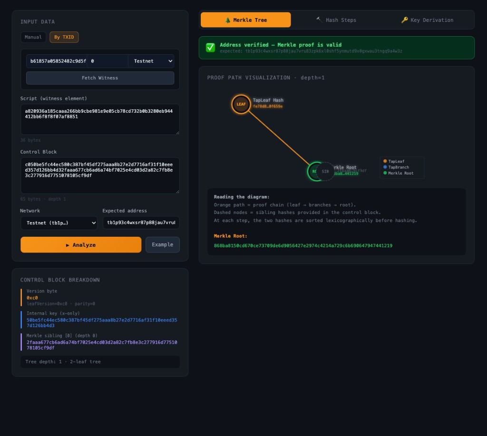
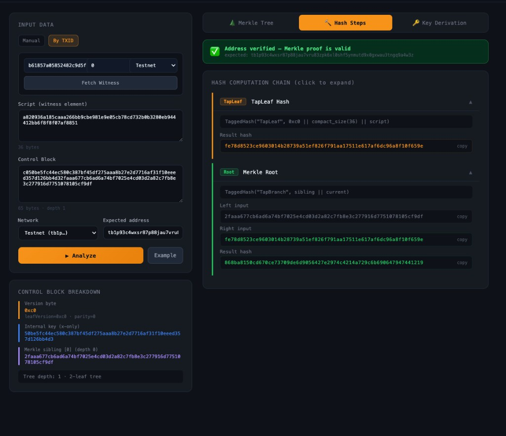
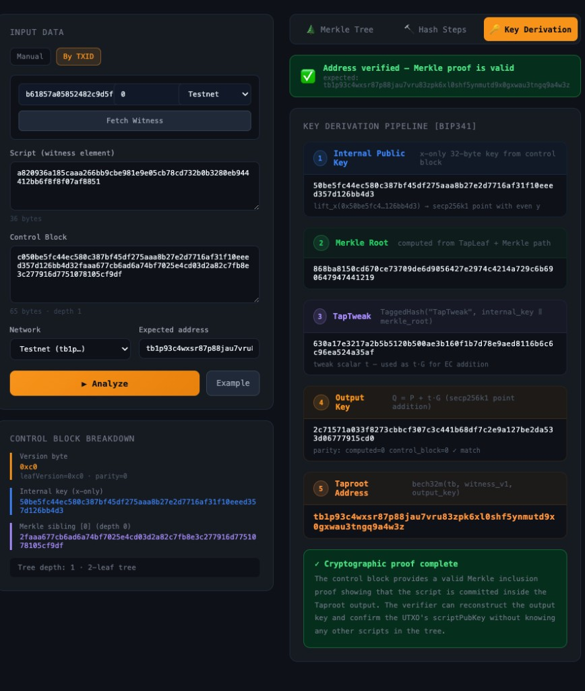

# RootScope

RootScope is a Taproot script-path analyzer focused on reproducibility.

- Python backend for deterministic BIP341 reconstruction
- React frontend for step-by-step visualization
- CLI for single-transaction checks and batch research runs

RootScope is part of the same open Bitcoin education/tooling ecosystem as
[`mastering-taproot`](https://github.com/aaron-recompile/mastering-taproot)
and [`btcaaron`](https://github.com/aaron-recompile/btcaaron).

## Research Motivation

Taproot enables complex spending conditions while keeping output structure uniform.
In practice, script-path spends are still hard to inspect because reconstructing
TapLeaf hashes, Merkle paths, tweaks, and output addresses from witness data is
error-prone when done manually.

RootScope focuses on deterministic reconstruction and reproducible verification for
script-path cases. It is intended as supporting infrastructure for technical review,
education, and preliminary empirical analysis.

Observed in current public sample window:

- script-path spending appears template-concentrated in the analyzed sample
- control-block depth is mostly shallow (single-leaf)

Open questions for further study:

- broader template distribution across longer time ranges
- depth distribution at larger scale
- implementation-pattern diversity across independent sample windows

## Why RootScope

Given `script + control block`, RootScope reconstructs:

- TapLeaf hash
- Merkle path/root
- TapTweak
- output key + bech32m address
- optional expected-address match result

This makes it useful for education, debugging, and preliminary empirical studies.

## Architecture

RootScope has three components:

- **Python backend**
  - TapLeaf hashing, Merkle path/root reconstruction, TapTweak derivation
  - deterministic address reconstruction and validation checks
- **CLI interface**
  - single transaction verification
  - batch processing with structured output
- **React visualization**
  - step-by-step hash and key-derivation walkthrough
  - human-readable explanation of control-block parsing and parity checks

## Quick Start

### 1) Setup

```bash
python3 -m venv .venv
./.venv/bin/python -m pip install -r backend/requirements.txt
```

### 2) Validate core logic

```bash
make regression
make bip341-vectors
```

### 3) Run a quick batch sample

```bash
./.venv/bin/python -m backend.cli batch \
  --input-csv data/sample_batch.csv \
  --out outputs/sample_batch.jsonl \
  --summary outputs/sample_batch_summary.csv
```

## Example Output

Command:

```bash
./.venv/bin/python -m backend.cli tx b61857a05852482c9d5ffbb8159fc2ba1efa3dd16fe4595f121fc35878a2e430 --vin 0 --network testnet
```

Output excerpt:

```text
Taproot Reconstruction
- merkle root:   868ba8150cd670ce73709de6d9056427e2974c4214a729c6b690647947441219
- tweak:         630a17e3217a2b5b5120b500ae3b160f1b7d78e9aed8116b6c6c96ea524a35af
- address:       tb1p93c4wxsr87p88jau7vru83zpk6xl0shf5ynmutd9x0gxwau3tngq9a4w3z
- parity match:  True
```

## Validation Snapshot

Current coverage includes:

- chapter06/07/08 vectors (from [`mastering-taproot`](https://github.com/aaron-recompile/mastering-taproot), book: [Leanpub](https://leanpub.com/mastering-taproot))
- official [BIP-0341](https://github.com/bitcoin/bips/blob/master/bip-0341.mediawiki) script-path vectors ([`wallet-test-vectors.json`](https://github.com/bitcoin/bips/blob/master/bip-0341/wallet-test-vectors.json), 12/12 paths)
- unbalanced tree case (`TapBranch(TapBranch(A,B),C)`)
- control block length/depth guards and parity checks

Empirical note (public sample):

- `data/empirical_sample_v0_1_0.csv` contains a small reproducible mainnet sample (300 rows)
- in this sample window, script-path structure is template-concentrated and depth is mostly shallow
- this is a preliminary sample for reproducibility, not a broad network-level claim
- complex/deeper behavior is validated separately through BIP341 + chapter06/07/08 vectors

## Future Work

Planned extensions (research-oriented, not yet complete):

- larger public reproducibility bundles built from openly shareable inputs
- richer script-template labeling and conservative classification notes
- broader depth/distribution reporting across more sample windows
- additional cross-check workflows with external script-analysis tooling

## Docs

- Detailed command reference and reproducible workflows: `docs/REPRODUCE.md`
- btcdeb side-by-side check: `docs/BTCDEB_COMPARISON.md`
- sample data notes: `data/README.md`

## Product Preview





## Acknowledgements

This project is supported by [OpenSats](https://opensats.org/).

## License

- Code: **MIT** (see `LICENSE.md`)
- Documentation/content: **CC-BY-SA 4.0** (see `LICENSE.md`)
